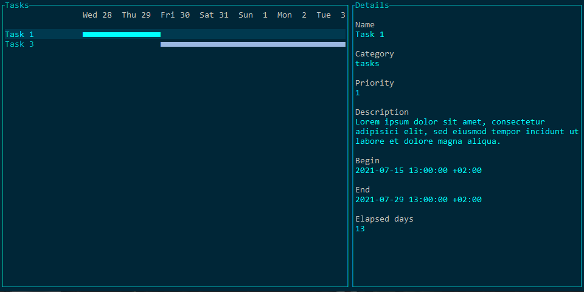

# tui-scheduler

(Very) minimalistic TUI task scheduler

The application reads a series of user-defined tasks from a JSON file, filters them by date and shows the relevant entries in a command line interface. 
The Rust [tui-rs](https://github.com/fdehau/tui-rs) library is used for the text interface. The initial development was based
on the rust-tui tutorial found here: [rust-and-tui-building-a-command-line-interface-in-rust](https://blog.logrocket.com/rust-and-tui-building-a-command-line-interface-in-rust).
The color scheme was inspired by the [Spotify TUI](https://github.com/Rigellute/spotify-tui).
The 'up' and 'down' keys are used for navigation, 'q' for exiting. 




The application expects a JSON file named 'tasks.json' file in the $HOME directory.
Its structure needs to be as follows:

```json
[
	{
		"name": "Task 1",
		"category": "tasks",
		"description": "Lorem ipsum dolor sit amet, consectetur adipisici elit, sed eiusmod tempor incidunt ut labore et dolore magna aliqua.",
		"priority": 1,
		"begin": "2019-01-01T11:00:00Z",
		"end": "2021-07-29T11:00:00Z"
	},
	{
		"name": "Task 2",
		"category": "tasks",
		"description": "",
		"priority": 2,
		"begin": "2016-01-01T11:00:00Z",
		"end": "2018-01-01T11:00:00Z"
	},
	{
		"name": "Task 3",
		"category": "tasks",
		"description": "",
		"priority": 2,
		"begin": "2021-07-30T11:00:00Z",
		"end": "2022-01-01T11:00:00Z"
	}
]
```


